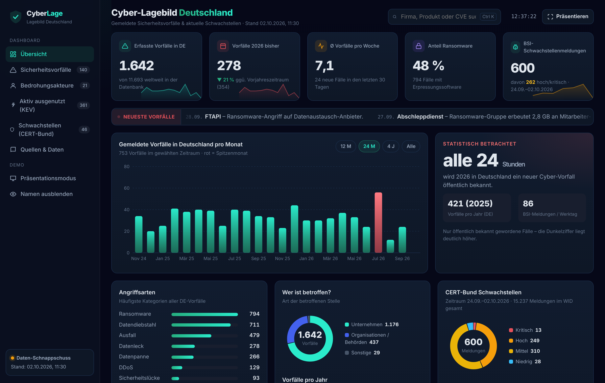
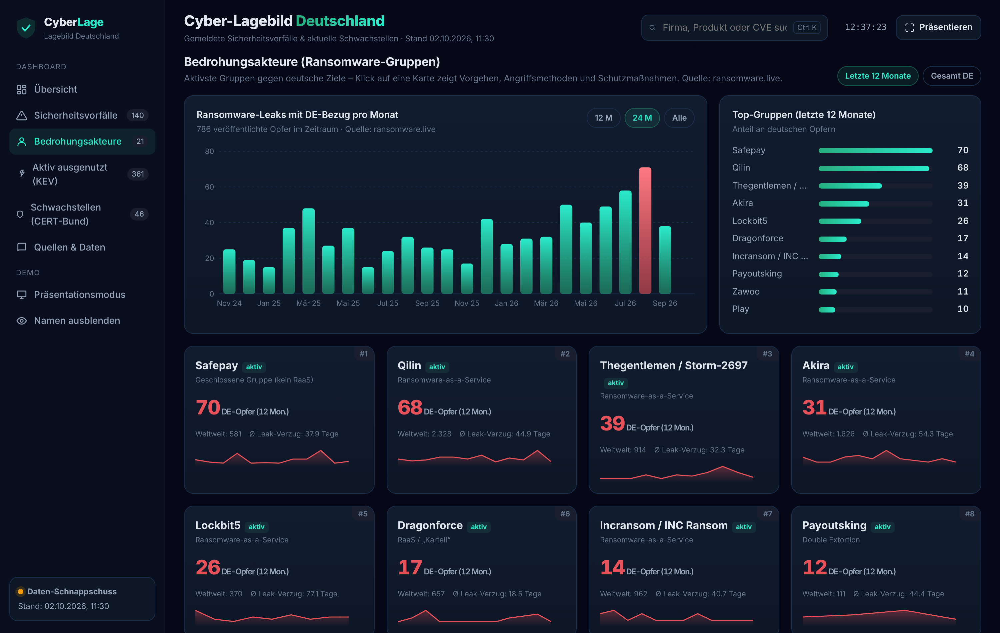
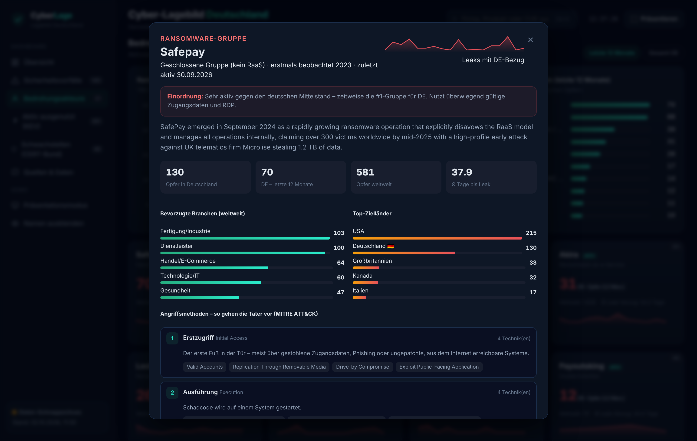
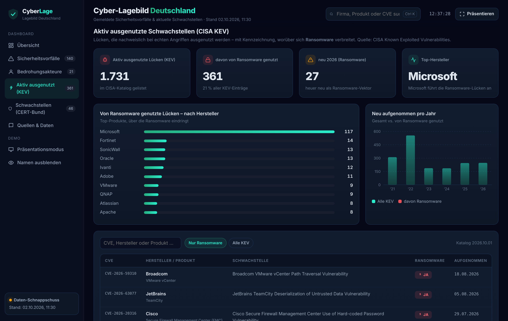
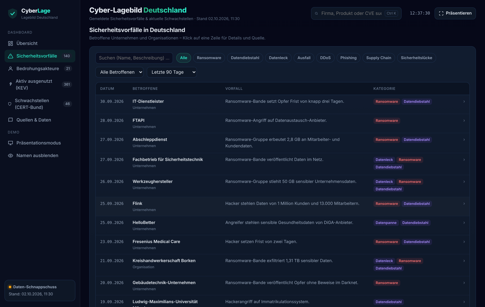
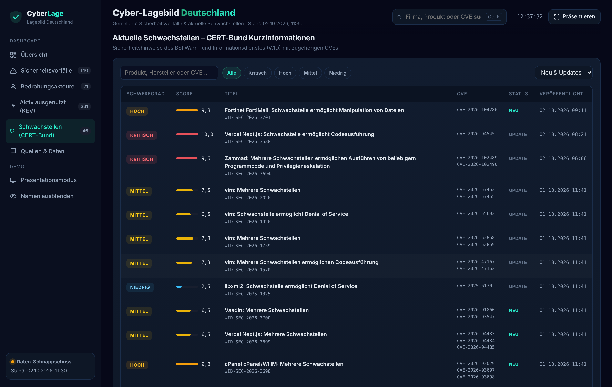

# Cyber-Lagebild Deutschland

Ein lokales, eigenständiges Dashboard (eine HTML-Datei) zur **Cyber-Bedrohungslage in Deutschland** –
gedacht für Awareness- und Kundengespräche. Es bündelt öffentlich verfügbare Daten zu
Sicherheitsvorfällen, Ransomware-Gruppen, aktiv ausgenutzten Schwachstellen und aktuellen CVEs
in einer Ansicht und läuft **ohne Installation direkt im Browser**.



> **Hinweis:** Alle Daten stammen aus öffentlich zugänglichen Drittquellen (siehe unten) und sind
> ohne Gewähr. Das Projekt ist eine Visualisierungs-/Demo-Hülle, keine offizielle Statistik.

---

## Inhalt

- [Schnellstart](#schnellstart)
- [Was zeigt das Dashboard?](#was-zeigt-das-dashboard)
  - [1. Übersicht](#1-übersicht)
  - [2. Bedrohungsakteure](#2-bedrohungsakteure-ransomware-gruppen)
  - [3. Aktiv ausgenutzt (CISA KEV)](#3-aktiv-ausgenutzt-cisa-kev)
  - [4. Sicherheitsvorfälle](#4-sicherheitsvorfälle)
  - [5. Schwachstellen (CERT-Bund)](#5-schwachstellen-cert-bund)
- [Datenquellen](#datenquellen)
- [Daten aktualisieren](#daten-aktualisieren)
- [Für Kundentermine](#für-kundentermine)
- [Projektstruktur](#projektstruktur)
- [Technik](#technik)
- [Haftungsausschluss](#haftungsausschluss)

---

## Schnellstart

1. Repository herunterladen (grüner **Code**-Button → *Download ZIP*) und entpacken.
2. `index.html` per Doppelklick im Browser öffnen (Chrome, Edge oder Firefox).

Das war's – es wird kein Server und keine Installation benötigt. Für die Online-Schrift
(Inter) ist beim ersten Laden eine Internetverbindung schön, aber nicht nötig; ohne Internet
greift automatisch die Systemschrift.

---

## Was zeigt das Dashboard?

Das Dashboard ist in fünf Bereiche gegliedert, die über die Seitenleiste erreichbar sind.

### 1. Übersicht


Das Lage-Cockpit auf einen Blick:

- **Kennzahlen (oben):** erfasste Vorfälle in Deutschland, Vorfälle im laufenden Jahr inkl.
  Veränderung zum Vorjahr, Vorfälle pro Woche, Ransomware-Anteil und Zahl der aktuellen
  BSI-Schwachstellenmeldungen.
- **Monatsverlauf:** gemeldete Vorfälle pro Monat seit 2019, Zeitraum umschaltbar (12 Monate bis „Alle"),
  der Spitzenmonat ist hervorgehoben.
- **„Statistisch alle X Stunden …":** eine griffige Aussage als Gesprächseinstieg.
- **Weitere Diagramme:** häufigste Angriffsarten, Art der Betroffenen (Unternehmen/Behörde),
  Vorfälle pro Jahr sowie die CERT-Bund-Meldungen nach Schweregrad und pro Tag.

### 2. Bedrohungsakteure (Ransomware-Gruppen)



Die aktivsten Ransomware-Gruppen gegen deutsche Ziele, umschaltbar zwischen „letzte 12 Monate"
und „gesamt". Dazu ein Monatsverlauf der veröffentlichten Opfer und ein Ranking der Top-Gruppen.

**Ein Klick auf eine Gruppenkarte öffnet ein ausführliches Täterprofil:**



- Einordnung und Geschäftsmodell (RaaS, geschlossene Gruppe, reine Datenerpressung …)
- Kennzahlen: Opfer in Deutschland, weltweit, durchschnittliche Zeit bis zur Leak-Veröffentlichung
- bevorzugte Branchen und Zielländer (Deutschland hervorgehoben)
- **Angriffsmethoden als aufklappbare [MITRE-ATT&CK](https://attack.mitre.org/)-Kette** – pro Phase
  (Erstzugriff, Ausführung … bis Schaden) mit deutscher Erklärung, den einzelnen Techniken und einem
  **Schutz-Fazit** mit den wirksamsten Gegenmaßnahmen
- eingesetzte Werkzeuge und die zuletzt betroffenen deutschen Firmen

Die Methodenbeschreibungen sind bewusst auf Awareness-Ebene gehalten (was es ist, woran man es
erkennt, wie man sich schützt) – nach dem öffentlichen MITRE-ATT&CK-Framework.

### 3. Aktiv ausgenutzt (CISA KEV)



Die **Known-Exploited-Vulnerabilities**-Liste der US-Behörde CISA: Schwachstellen, die
nachweislich bei echten Angriffen ausgenutzt werden. Entscheidend ist hier die Kennzeichnung,
**über welche Lücken sich Ransomware verbreitet**.

- Kennzahlen: Gesamtzahl aktiv ausgenutzter Lücken, davon von Ransomware genutzt, Neuzugänge im Jahr
- **Hersteller-Ranking:** über welche Produkte Ransomware am häufigsten eindringt
  (typische Einfallstore: VPNs, Firewalls, Fileserver, SharePoint)
- Jahresverlauf (alle KEV vs. davon von Ransomware genutzt)
- durchsuchbare Tabelle mit Umschalter „Nur Ransomware / Alle KEV", CVE-Link zur NVD und einer
  klaren **„Ja"-Markierung** für Ransomware-Vektoren

### 4. Sicherheitsvorfälle



Die Tabelle aller erfassten Vorfälle in Deutschland – mit **Namen der Betroffenen**, Suche und
Filtern nach Kategorie, Art und Zeitraum. Ein Klick auf eine Zeile zeigt die Details und verlinkt
zur Originalquelle.

### 5. Schwachstellen (CERT-Bund)



Die aktuellen Kurzinformationen des BSI CERT-Bund (Warn- und Informationsdienst): Schweregrad,
CVSS-Score, zugehörige CVEs (verlinkt zur NVD) und Status. Ein Klick öffnet die BSI-Meldung.

---

## Datenquellen

| Bereich | Quelle |
| --- | --- |
| Sicherheitsvorfälle (benannte Betroffene) | [security-incidents.de](https://www.security-incidents.de/sicherheitsvorfall-datenbank/) (Holzhofer Consulting) |
| Schwachstellen / CVEs | [BSI CERT-Bund – WID](https://wid.cert-bund.de/portal/wid/kurzinformationen) |
| Ransomware-Gruppen, Opfer, TTPs | [ransomware.live](https://www.ransomware.live/) |
| Chronik benannter Fälle 2026 | [Security-Insider](https://www.security-insider.de/cyberangriffe-auf-deutsche-unternehmen-2026-aktuell-a-a5a23f3399455167641a185a6f28549b/) (Vogel IT-Medien) |
| Aktiv ausgenutzte Lücken | [CISA Known Exploited Vulnerabilities](https://www.cisa.gov/known-exploited-vulnerabilities-catalog) |
| Erklärung der Angriffsmethoden | [MITRE ATT&CK](https://attack.mitre.org/) |

Bitte bei Präsentationen die jeweilige Quelle nennen. Viele kleinere Betroffene sind in den
Quelldatenbanken bereits anonymisiert (z. B. „IT-Dienstleister").

---

## Daten aktualisieren

Das Dashboard enthält einen **Daten-Schnappschuss** zum Zeitpunkt der Erstellung. Um die
Vorfälle, Schwachstellen und KEV-Daten zu aktualisieren:

- **Windows:** `aktualisieren.bat` doppelklicken
- **macOS/Linux:** `python3 update_data.py` ausführen

Danach die Seite im Browser neu laden (F5). Benötigt Python 3 (nur Standardbibliothek) und
Internetzugang. Das Skript ruft die Quellen browser-ähnlich ab; fällt eine Quelle aus
(z. B. Bot-Schutz oder die kostenlose ransomware.live-API), bleiben die anderen erhalten und das
Skript sagt, welche Quelle betroffen ist.

**Manueller Notnagel:** Falls eine Quelle das Skript hartnäckig blockt, lassen sich in der Sektion
„Quellen & Daten" die JSON-Rohdaten direkt im Browser öffnen, speichern und per Drag & Drop ins
Dashboard ziehen – alle Formate werden automatisch erkannt.

> Die handgepflegten Dateien `data_actors.js`, `data_knowledge.js` und `data_secinsider.js`
> (Gruppenprofile, Methoden-Erklärungen, Chronik) werden vom Update-Skript **nicht** überschrieben.

---

## Für Kundentermine

- **Präsentieren** (oben rechts): Vollbild ohne Seitenleiste, `ESC` beendet.
- **Namen ausblenden** (Seitenleiste): verwischt die Betroffenennamen, falls nötig.
- **Strg + K:** Schnellsuche über Vorfälle und Schwachstellen – z. B. nach der Branche oder einem
  Produkt des Kunden.
- Ein stimmiger Erzählbogen: **Bedrohungsakteure** (wer greift an) → **KEV** (worüber sie reinkommen)
  → **Schutz-Fazit im Täterprofil** (was dagegen hilft).

---

## Projektstruktur

```
index.html            Das Dashboard (Struktur, Stil, Logik in einer Datei)
data.js               Vorfälle & CERT-Bund-Schwachstellen      (Update-Skript überschreibt)
data_ransomware.js    Ransomware-Opfer & Gruppen-Statistik     (Update-Skript überschreibt)
data_kev.js           CISA KEV – aktiv ausgenutzte Lücken       (Update-Skript überschreibt)
data_actors.js        Profile der Ransomware-Gruppen (TTPs, Tools)   – von Hand gepflegt
data_knowledge.js     Erklärungen der Angriffsmethoden & Einordnung  – von Hand gepflegt
data_secinsider.js    Chronik benannter Fälle (Security-Insider)      – von Hand gepflegt
update_data.py        Lädt security-incidents.de, CERT-Bund, ransomware.live und CISA KEV
aktualisieren.bat     Windows-Starter für das Update
docs/screenshots/     Screenshots für dieses README
```

---

## Technik

- **Eine Datei, keine Abhängigkeiten:** reines HTML, CSS und JavaScript (Vanilla, kein Framework,
  kein Build). Diagramme sind handgezeichnetes Inline-SVG.
- **Datenhaltung:** die Daten liegen als einfache `window.*`-Objekte in den `data_*.js`-Dateien.
- **Update-Skript:** Python 3 (nur Standardbibliothek), kein `pip install` nötig.
- **Design:** dunkles Farbschema (Navy/Türkis), angelehnt an ein modernes Dashboard-Layout.

---

## Haftungsausschluss

Dieses Projekt dient der Veranschaulichung und Awareness. Es stellt ausschließlich öffentlich
zugängliche Informationen dar und erhebt keinen Anspruch auf Vollständigkeit oder Richtigkeit.
Die Angaben enthalten nur öffentlich bekannt gewordene Fälle – die Dunkelziffer liegt deutlich
höher. Alle Marken, Daten und Inhalte gehören den jeweiligen Rechteinhabern bzw. Quellen.
